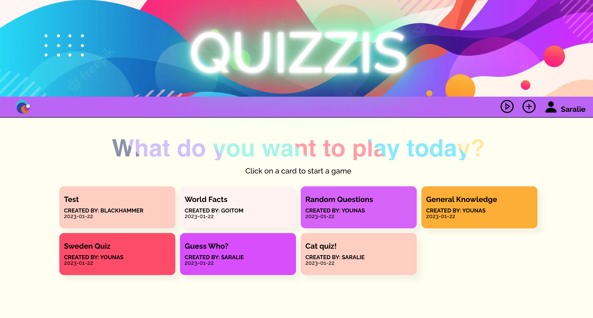

# Final Project Quizzis

Quizzis is our final project application at Technigos developed by Saralie Bognandi, Sarah Kneedler and Younas Tesfamariam.
Our idea was to create a platform where users can play and create their own quizzes.
***
**Frontend**

This is a multi-page React application built using React router and Redux as state manager.

**Backend**

We have developed the Backend for this application which consist of 

-A RESTful API build with Node.js\
-Express for our web framework \
-Mongoose to interact with our MongoDB database.
***
**Problems**
* Authenticate user does not work properly as you can login with false credentials.

* When refreshing page on the deployed site while logged in, an error message displays "Page Not Found".
* When that happens you will have to manually redirect to https://quizzis.netlify.app/ to get the correct data.

* When playing a quiz, the state is delayed, so the submit button needs to be clicked twice.
***

**If we had more time**
* When playing the quiz, an aleart message will notify if your answer is correct or false. We would like to style the radio buttons with the same information using CSS instead.

* Scoreboard is now showing all scores in order, we would like to sort and filter to the display only the top 3.

* Possiblity to edit, comment, and like quizzes and to set quiz to public or private.

* Possiblity to sort quizzes on difficulty level on category or creator.

* We would like to destructure our larger components and have a better file structure.

* Be more consistance with our styling.
***

**Additional Packages used**

* React icons
* Styled components
***
Setup
👉🏽 To run this project:

* Download it locally.
* Change URL in server.js (backend folder) and in urls.js (frontend folder) to localhost.
* Run Backend with npm run dev.
* Run Frontend with npm start.
* Now you are all set!
***
**View it live**

✨ Frontend:https://quizzis.netlify.app/
>🔥 Backend :https://final-project-quiz-gl4puda6xq-lz.a.run.app/
